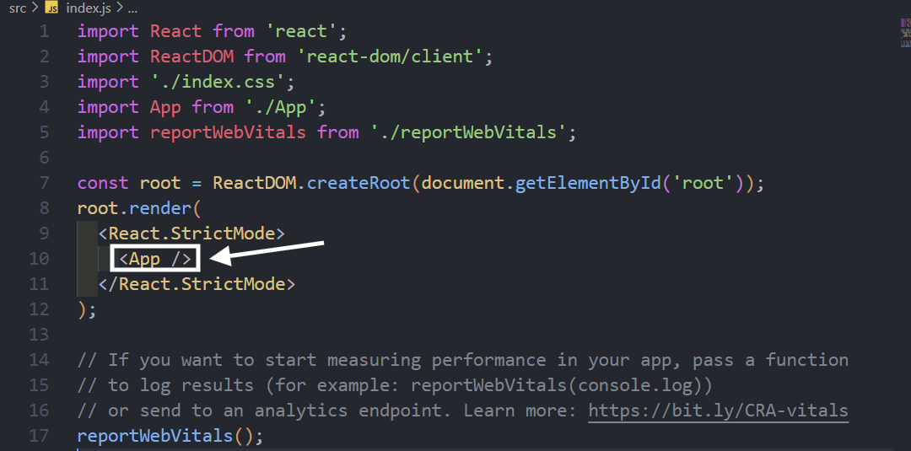
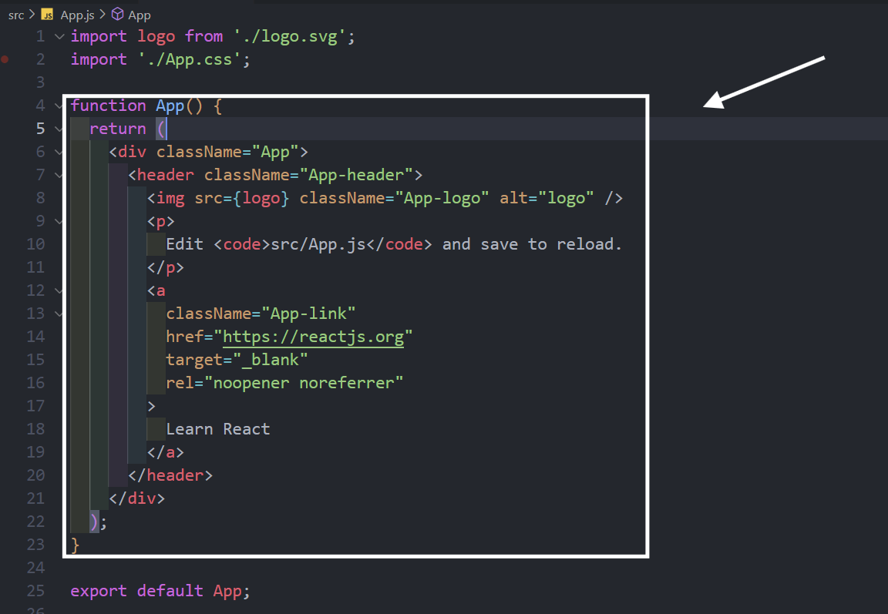
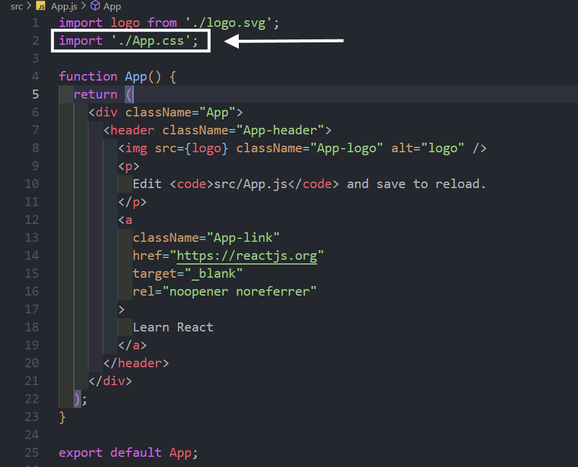
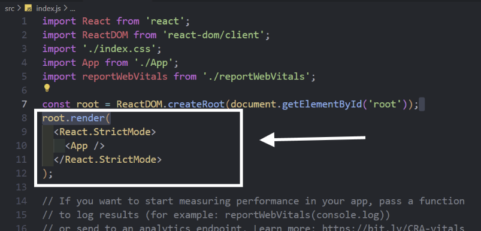
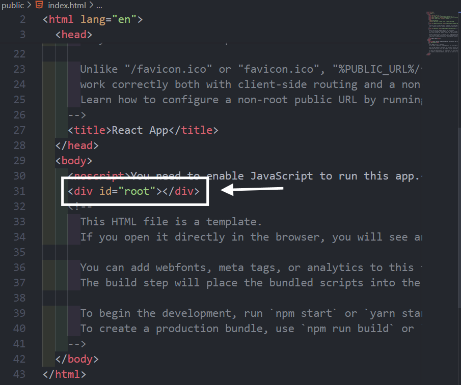
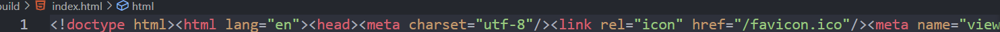
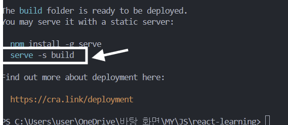
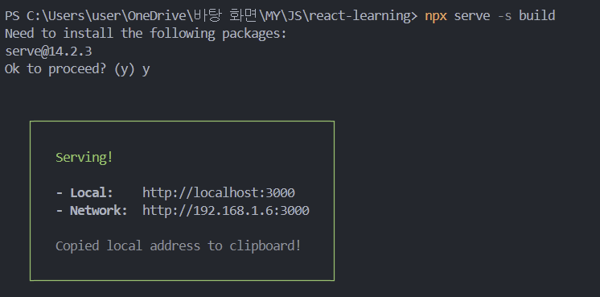

## 코드 수정

1. src 폴더
2. index.js

- 입구
- 여러가지 전역적인 설정들 포함
- \<App /> 안에 app.js이 들어가있음
  
- 여기서 내용 편집
  
- 디자인은 여기서
  
- \<APP />이라는 태그가 id값이 root인 태그로 렌더링되라는 코드
  
- id값이 root인 태그는 어디에?
  
  - public 폴더 -> index.html
    

---

## 베포

1. 터미널
   > ctrl + c

- 기존에 있던 개발 환경을 **끄고** 싶을 때 사용
  > npm run build
- **베포 판**을 만드는 과정

2. **build 폴더 생성** 됨

- 공백조차 없음
  
- -s
  - user가 어떤 경로로 들어오던간에 index.html 로 가게함
- build
  - build 폴더 안에 index.html로 가겠다
    

3. 터미널
   > npx serve -s build

- npx - node.js로 만들어진 serve이기 때문에 이를 간편하게 사용
  
  => 개발 환경을 위한 서비스 아님
  => **실제로 서비스에서 사용할 수 있는 버전의 파일**
