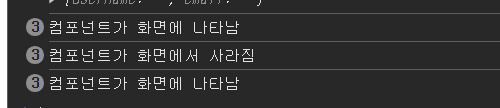
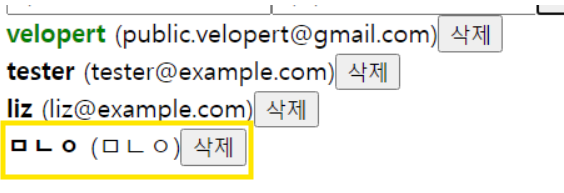
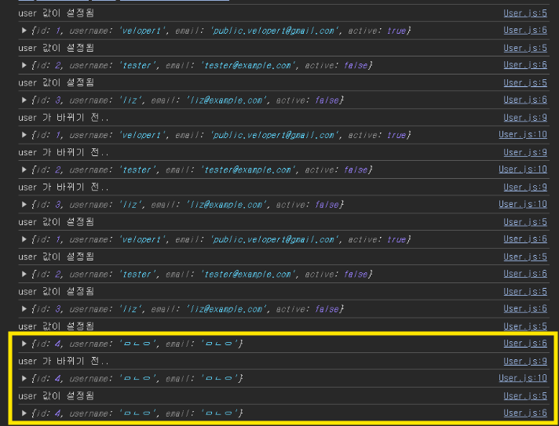
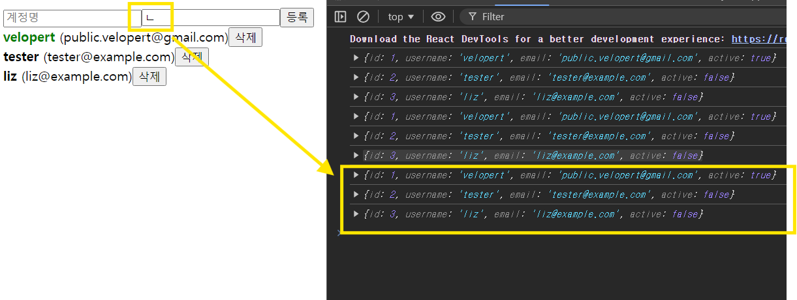

### 1. 마운트/언마운트 시 작업 설정

**마운트**?
컴포넌트가 처음 화면에 나타날 때
**언마운트**?
컴포넌트가 화면에서 사라질 때
⇒ `useEffect` 사용

`User`

```js
import React, { useEffect } from "react";

function User({ user, onRemove, onToggle }) {
  useEffect(() => {
    console.log("컴포넌트가 화면에 나타남"); // 마운트시 나타남

    return () => {
      console.log("컴포넌트가 화면에서 사라짐"); // 언마운트시 나타남 (cleanup 함수)
    };
  }, []); // 빈 배열: 마운트/언마운트 시에만 실행
  return (
    <div>
      <b
        style={{
          cursor: "pointer",
          color: user.active ? "green" : "black",
        }}
        onClick={() => onToggle(user.id)}
      >
        {user.username}
      </b>
      &nbsp;
      <span>({user.email})</span>
      <button onClick={() => onRemove(user.id)}>삭제</button>
    </div>
  );
}

export default User;
```



### 요약:

- **빈 배열(`[]`)** 을 deps에 넣으면?
  - 컴포넌트가 **처음 나타날 때**와 **사라질 때**만 `useEffect`가 실행
- **마운트 시 실행할 작업** : `useEffect` 내부에 작성
- **언마운트 시** 실행할 작업 : `return`하는 **cleanup 함수**에 작성

---

### 2. 특정 값이 변경될 때 작업 설정

**특정** props나 상태값이 변경될 때마다 작업을 수행하고 싶다면?
`useEffect`의 deps 배열에 그 값을 넣기

```js
import React, { useEffect } from "react";

function User({ user, onRemove, onToggle }) {
  useEffect(() => {
    console.log("user 값이 설정됨");
    console.log(user);

    return () => {
      console.log("user 가 바뀌기 전..");
      console.log(user);
    };
  }, [user]); // 'user'가 바뀔 때마다 실행
  return (
    <div>
      <b
        style={{
          cursor: "pointer",
          color: user.active ? "green" : "black",
        }}
        onClick={() => onToggle(user.id)}
      >
        {user.username}
      </b>
      &nbsp;
      <span>({user.email})</span>
      <button onClick={() => onRemove(user.id)}>삭제</button>
    </div>
  );
}

export default User;
```

### 요약:

- `useEffect`의 **deps 배열에 `user`를 넣으면**?
  - `user` 값이 변경될 때마다 `useEffect`가 실행
- **컴포넌트가 업데이트될 때 실행할 작업** : `useEffect` 내부에 작성
- **업데이트 전 cleanup 작업** : `return`하는 함수에 작성




---

### 3. 리렌더링마다 실행

`useEffect`의 deps 배열을 생략?
컴포넌트가 **리렌더링될 때마다** `useEffect`가 실행

```js
import React, { useEffect } from "react";

function User({ user, onRemove, onToggle }) {
  useEffect(() => {
    console.log(user); // 리렌더링마다 실행됨
  });
  return (
    <div>
      <b
        style={{
          cursor: "pointer",
          color: user.active ? "green" : "black",
        }}
        onClick={() => onToggle(user.id)}
      >
        {user.username}
      </b>
      &nbsp;
      <span>({user.email})</span>
      <button onClick={() => onRemove(user.id)}>삭제</button>
    </div>
  );
}

export default User;
```



---

### 마무리 요약

1. **마운트/언마운트**: `[]` 배열을 deps로 전달.
2. **특정 값이 변경될 때**: `useEffect`의 deps 배열에 특정 값을 넣어 해당 값이 바뀔 때만 실행.
3. **리렌더링마다 실행**: deps 배열을 생략하여 컴포넌트 리렌더링 때마다 실행.

---

### 추가 참고 코드

`UserList`

```js
import User from "./User";

function UserList({ users, onRemove, onToggle }) {
  return (
    <div>
      {users.map((user) => (
        <User
          user={user}
          key={user.id}
          onRemove={onRemove}
          onToggle={onToggle}
        />
      ))}
    </div>
  );
}

export default UserList;
```
