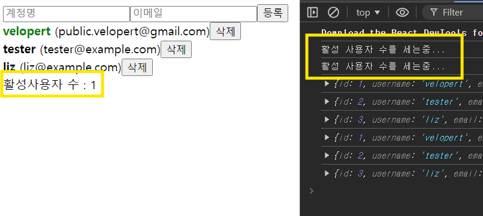
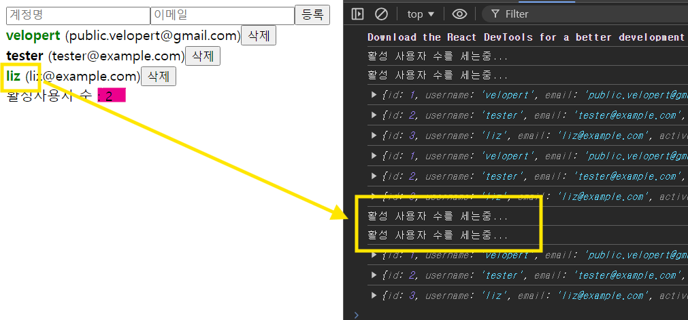

# `useMemo`?

- React의 Hook
- **성능 최적화**를 위해 사용되는 기능
- 특정 값 **메모이제이션**(기억) → **의존성 배열의 값이 변경될 때만 재계산하도록 도움**
  사용 전 vs 후
- 전 (기본적인 React 컴포넌트 ): 상태(state)나 속성(props)이 변경될 때마다 리렌더링 ⇒ **모든 연산이 다시 수행**
- 후 : **불필요한 연산 피하고, 성능 향상**

---

### `useMemo`의 주요 기능 및 사용법

1. **메모이제이션**:
   - `useMemo`는 특정 값을 저장해 두고, 의존성 배열의 값이 변경되면 그 값을 다시 계산. 또는 이전에 계산한 값을 재사용.
2. **사용법**:

   ```jsx
   const memoizedValue = useMemo(() => {
     // 계산할 값
     return computeExpensiveValue(a, b);
   }, [a, b]); // a 또는 b가 변경될 때만 재계산
   ```

3. **인자**:
   - 첫 번째 인자: 메모이제이션할 값을 계산하는 함수.
   ```js
   () => {
     // 계산할 값
     return computeExpensiveValue(a, b);
   };
   ```
   - 두 번째 인자: 의존성 배열. 이 배열 안의 값이 변경되면 첫 번째 인자의 함수가 다시 호출
   ```js
   [a, b];
   ```
4. **성능 최적화**:
   - `useMemo`를 사용하면 컴포넌트가 리렌더링될 때마다 계산 비용이 큰 연산을 피하기 가능
   - 리스트 필터링, 정렬, 복잡한 계산 등을 메모이제이션할 때 유용
5. **주의사항**:
   - `useMemo`는 성능 최적화를 위한 도구이지만, 사용을 남용하면 오히려 복잡성을 증가시키고 코드의 가독성을 떨어뜨릴 수 있음!!
     **꼭 필요한 경우에만 사용하도록 해야함**

---

### 예제

복잡한 계산을 최적화하는 예제

```jsx
import React, { useState, useMemo } from "react";

function ExpensiveComponent({ number }) {
  const computeExpensiveValue = (num) => {
    console.log("계산 중...");
    // 시간 소모적인 연산
    return num * 2; // 예시로 단순 계산
  };

  const memoizedValue = useMemo(() => computeExpensiveValue(number), [number]);

  return (
    <div>
      <h1>결과: {memoizedValue}</h1>
    </div>
  );
}

function App() {
  const [count, setCount] = useState(0);
  const [number, setNumber] = useState(1);

  return (
    <div>
      <button onClick={() => setCount(count + 1)}>Count: {count}</button>
      <input
        type="number"
        value={number}
        onChange={(e) => setNumber(Number(e.target.value))}
      />
      <ExpensiveComponent number={number} />
    </div>
  );
}

export default App;
```

---

### 요약

- **`useMemo`** 는 성능 최적화를 위해 특정 값의 계산 결과를 메모이제이션하는 Hook
- 의존성 배열에 지정된 값이 변경될 때만 재계산되므로, 불필요한 계산을 피함
- 사용 시에는 꼭 필요한 경우에만 사용하는 것이 좋습니다.

useMemo에 대한 설명은 여기까지임. 아래는 활용임

---

## 활용

#### 문제 설명

기존 코드에서는 `countActiveUsers` 함수가 `users` 배열의 상태가 변하지 않아도, 입력값이 바뀔 때마다 호출
⇒ 불필요한 연산이 발생하여 성능에 영향을 미칠 수 있음
⇒ `useMemo` 사용 → **최적화**

#### 코드 수정 단계

1. **`useMemo` Import**: `useMemo`를 React에서 가져오기
2. **`count` 변수 수정**: `count` 변수를 `useMemo`를 사용하여 정의

---

#### 최적화 코드

`App`

```jsx
import React, { useRef, useState, useMemo } from "react";
import UserList from "./UserList";
import CreateUser from "./CreateUser";

function countActiveUsers(users) {
  console.log("활성 사용자 수를 세는중...");
  return users.filter((user) => user.active).length;
}

function App() {
  const [inputs, setInputs] = useState({
    username: "",
    email: "",
  });
  const { username, email } = inputs;

  const onChange = (e) => {
    const { name, value } = e.target;
    setInputs({
      ...inputs,
      [name]: value,
    });
  };

  const [users, setUsers] = useState([
    {
      id: 1,
      username: "velopert",
      email: "public.velopert@gmail.com",
      active: true,
    },
    { id: 2, username: "tester", email: "tester@example.com", active: false },
    { id: 3, username: "liz", email: "liz@example.com", active: false },
  ]);

  const nextId = useRef(4);

  const onCreate = () => {
    const user = {
      id: nextId.current,
      username,
      email,
    };
    setUsers(users.concat(user));

    setInputs({
      username: "",
      email: "",
    });
    nextId.current += 1;
  };

  const onRemove = (id) => {
    setUsers(users.filter((user) => user.id !== id));
  };

  const onToggle = (id) => {
    setUsers(
      users.map((user) =>
        user.id === id ? { ...user, active: !user.active } : user
      )
    );
  };

  // useMemo를 사용하여 countActiveUsers의 결과를 memoize
  const count = useMemo(() => countActiveUsers(users), [users]);

  return (
    <>
      <CreateUser
        username={username}
        email={email}
        onChange={onChange}
        onCreate={onCreate}
      />
      <UserList users={users} onRemove={onRemove} onToggle={onToggle} />
      <div>활성사용자 수 : {count}</div>
    </>
  );
}

export default App;
```




---

#### 주요 변경 사항 설명

- **`useMemo`**:
  - `count` 변수를 설정,
  - 두 가지 인자를 받음
    - 첫 번째 인자: `countActiveUsers(users)` 함수를 호출하는 콜백.
    - 두 번째 인자: 의존성 배열 `[users]`. `users` 배열이 변경될 때만 `countActiveUsers` 함수 호출
      ⇒ 입력값이 변경되더라도 `countActiveUsers`가 호출 X
      → 성능 최적화

#### 성능 최적화 확인

- 이제 사용자가 활성화/비활성 상태를 변경할 때는 "활성 사용자 수를 세는중..." 메시지가 출력되지만, 입력 필드 값을 수정할 때는 출력되지 않아 성능이 개선 됨
