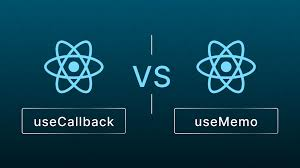

# `useCallback` ?

- **목적**: 컴포넌트가 리렌더링될 때마다 새로운 함수를 생성하는 것을 방지하여 성능 최적화를 돕습니다. 동일한 함수 인스턴스를 재사용 가능

---

### 사용 이유

- **성능 최적화**: 컴포넌트 리렌더링 시 새 함수 생성 X → 메모리, CPU 리소스 절약
- **하위 컴포넌트 최적화**: `useCallback`으로 생성한 함수를 props로 전달할 때, 함수가 변경되지 않으면 하위 컴포넌트가 불필요하게 리렌더링되는 것을 방지

---

### 기본 문법

```jsx
const memoizedCallback = useCallback(() => {
  // 함수 내용
}, [dependency1, dependency2, ...]);
```

- **첫 번째 인자**: <u>메모이제이션할 함수</u>.
- **두 번째 인자**: 의존성 배열. 배열에 포함된 값이 변경될 때만 새로운 함수가 생성됨.

---

#### 예제 코드

```jsx
import React, { useState, useCallback } from "react";

function App() {
  const [count, setCount] = useState(0);

  const onIncrement = useCallback(() => {
    setCount((c) => c + 1);
  }, []); // 의존성 배열이 비어있어, 한 번만 생성됨

  return (
    <div>
      <p>Count: {count}</p>
      <button onClick={onIncrement}>Increment</button>
    </div>
  );
}

export default App;
```

---

#### 주의 사항

- **의존성 배열**: 배열에 상태나 props 포함 X = 최신 값 참조 X

  ```jsx
  const handleClick = useCallback(() => {
    console.log(value); // value를 의존성 배열에 포함
  }, [value]);
  ```

- **비용 대비 효용**: 작은 컴포넌트에서는 오히려 성능 저하가 발생할 수 있음
  → 복잡한 계산이 필요할 때 사용하기 좋음.

---

#### 요약

- `useCallback` : 함수를 메모이제이션 → 성능 최적화를 도와주는 React Hook
- 의존성 배열을 활용 → 함수의 생성 시점 제어 가능.
- 하위 컴포넌트와의 관계에서 불필요한 리렌더링을 방지 가능

---

### `useMemo`와의 차이점



#### 1. 목적

- **`useMemo`**: 계산된 값을 메모이제이션하여 성능 최적화. 주로 계산 비용이 큰 값을 재사용할 때 사용.
- **`useCallback`**: 함수를 메모이제이션하여 컴포넌트가 리렌더링될 때 동일한 함수 인스턴스를 재사용. 하위 컴포넌트에 props로 함수를 전달할 때 사용.

#### 2. 사용법

- **`useMemo`**

  ```jsx
  const memoizedValue = useMemo(() => {
    return expensiveCalculation(a, b);
  }, [a, b]);
  ```

- **`useCallback`**

  ```jsx
  const memoizedCallback = useCallback(() => {
    doSomething(a, b);
  }, [a, b]);
  ```

#### 3. 반환 값

- **`useMemo`**: 계산된 값을 반환.
- **`useCallback`**: 메모이제이션된 **함수 인스턴스**를 반환.

#### 4. 의존성 배열

- 두 Hook 모두 의존성 배열을 사용
- `useMemo` : 값이 변경될 때마다 재계산
- `useCallback` : 참조하는 값이 변경될 때 새로운 함수를 생성

#### 5. 예제 코드

- **`useMemo` 예제**

  ```jsx
  import React, { useState, useMemo } from "react";

  function App() {
    const [count, setCount] = useState(0);

    const doubledCount = useMemo(() => {
      console.log("계산 중...");
      return count * 2;
    }, [count]);

    return (
      <div>
        <p>Count: {count}</p>
        <p>Doubled Count: {doubledCount}</p>
        <button onClick={() => setCount(count + 1)}>Increment</button>
      </div>
    );
  }
  ```

- **`useCallback` 예제**

  ```jsx
  import React, { useState, useCallback } from "react";

  function App() {
    const [count, setCount] = useState(0);

    const increment = useCallback(() => {
      setCount((c) => c + 1);
    }, []);

    return (
      <div>
        <p>Count: {count}</p>
        <button onClick={increment}>Increment</button>
      </div>
    );
  }
  ```

### 요약

- **`useMemo`**: 값의 메모이제이션을 통해 계산 성능 최적화.
- **`useCallback`**: 함수의 메모이제이션을 통해 불필요한 리렌더링 방지.

---

### React DevTools 활용

- **렌더링 확인**: 어떤 컴포넌트가 리렌더링되는지 확인 가능.
- **하이라이트 기능**: `Highlight Updates`를 활성화하면 리렌더링되는 컴포넌트가 하이라이트됨.

### 주요 포인트

1. **함수 재사용**: `useCallback`으로 감싼 함수는 의존성 배열에 명시된 값이 변경될 때만 새로운 함수가 생성됩니다.
2. **의존성 배열**: 상태와 props는 반드시 포함해야 최신 값을 참조할 수 있습니다.
3. **최적화 필요성**: `useCallback` 자체는 즉각적인 최적화를 제공하지 않지만, 후에 컴포넌트 렌더링 최적화 작업을 통해 성능 향상 가능.

---

### 활용

`app.js`

```js
import React, { useRef, useState, useMemo, useCallback } from "react";
import UserList from "./UserList";
import CreateUser from "./CreateUser";

function countActiveUsers(users) {
  console.log("활성 사용자 수를 세는중...");
  return users.filter((user) => user.active).length;
}

function App() {
  const [inputs, setInputs] = useState({
    username: "",
    email: "",
  });
  const { username, email } = inputs;
  const onChange = useCallback(
    (e) => {
      const { name, value } = e.target;
      setInputs({
        ...inputs,
        [name]: value,
      });
    },
    [inputs]
  );
  const [users, setUsers] = useState([
    {
      id: 1,
      username: "velopert",
      email: "public.velopert@gmail.com",
      active: true,
    },
    {
      id: 2,
      username: "tester",
      email: "tester@example.com",
      active: false,
    },
    {
      id: 3,
      username: "liz",
      email: "liz@example.com",
      active: false,
    },
  ]);

  const nextId = useRef(4);
  const onCreate = useCallback(() => {
    const user = {
      id: nextId.current,
      username,
      email,
    };
    setUsers(users.concat(user));

    setInputs({
      username: "",
      email: "",
    });
    nextId.current += 1;
  }, [users, username, email]);

  const onRemove = useCallback(
    (id) => {
      // user.id 가 파라미터로 일치하지 않는 원소만 추출해서 새로운 배열을 만듬
      // = user.id 가 id 인 것을 제거함
      setUsers(users.filter((user) => user.id !== id));
    },
    [users]
  );
  const onToggle = useCallback(
    (id) => {
      setUsers(
        users.map((user) =>
          user.id === id ? { ...user, active: !user.active } : user
        )
      );
    },
    [users]
  );
  const count = useMemo(() => countActiveUsers(users), [users]);
  return (
    <>
      <CreateUser
        username={username}
        email={email}
        onChange={onChange}
        onCreate={onCreate}
      />
      <UserList users={users} onRemove={onRemove} onToggle={onToggle} />
      <div>활성사용자 수 : {count}</div>
    </>
  );
}

export default App;
```
