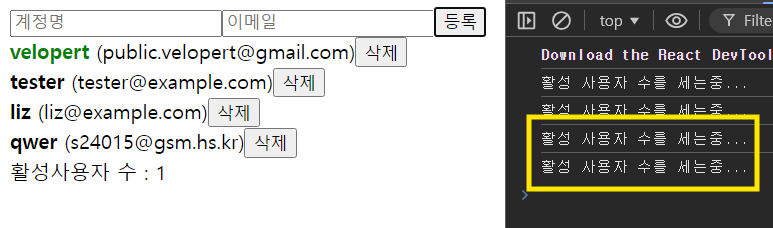

# `React.memo`?

컴포넌트의 리렌더링 성능을 최적화하기 위해 사용되는 고차 컴포넌트
주로 자식 컴포넌트의 props가 변경되지 않는 경우 리렌더링을 방지하여 불필요한 렌더링을 줄이는 데 도움

### 사용 방법

`React.memo`를 사용하려면 컴포넌트를 `React.memo`로 감싸주면 됨

```jsx
import React from "react";

const MyComponent = ({ prop1, prop2 }) => {
  return (
    <div>
      <p>{prop1}</p>
      <p>{prop2}</p>
    </div>
  );
};

export default React.memo(MyComponent); // 여기 ! ⭐
```

위 코드에서 `MyComponent`는 `React.memo`로 감싸져 있어, 부모 컴포넌트가 리렌더링될 때 props가 변경되지 않는 한 `MyComponent`는 리렌더링 X

### 기본 동작

- 기본적으로, `React.memo`는 이전 props와 다음 props를 얕게 비교(shallow comparison)하여 변경된 경우에만 컴포넌트를 리렌더링
- 이는 기본적인 최적화로, props가 동일하면 컴포넌트는 리렌더링 X

### 주의사항 ⭐

- **함수형 업데이트:**
  상태를 업데이트할 때 함수형 업데이트를 사용하면 `React.memo`의 효과를 더욱 극대화 가능
  **최신 상태 값 참조** → props 변경 최소화
- **불필요한 사용:**
  리렌더링 최적화를 위해 모든 컴포넌트에 `React.memo`를 사용할 필요 X
  성능 개선이 실제로 **필요한** 경우에만 사용해야함
  불필요한 props 비교로 인해 오히려 **성능 저하가 발생 가능**
- **함수형 업데이트 미사용:**
  컴포넌트 내에서 state가 변경될 때 함수형 업데이트 사용 X
  → 최신 상태를 참조 X
  → 예기치 않은 버그가 발생 할 수 있음

### 결론

`React.memo`는 성능 최적화에 매우 유용하지만, 실제 필요성에 따라 적절하게 사용하는 것이 중요
컴포넌트의 props가 **자주 변경되지 않는 경우**에 사용하면 불필요한 리렌더링을 줄여 애플리케이션의 성능 향상 가능

---

### 활용 - React.memo를 사용한 컴포넌트 리렌더링 방지

#### 적용

##### 1. CreateUser 컴포넌트

```jsx
// CreateUser.js
import React from "react";

const CreateUser = ({ username, email, onChange, onCreate }) => {
  return (
    <div>
      <input
        name="username"
        placeholder="계정명"
        onChange={onChange}
        value={username}
      />
      <input
        name="email"
        placeholder="이메일"
        onChange={onChange}
        value={email}
      />
      <button onClick={onCreate}>등록</button>
    </div>
  );
};

export default React.memo(CreateUser); // 여기 !!!!!!
```

###### 2. UserList 및 User 컴포넌트

```jsx
// UserList.js
import React from "react";

const User = React.memo(function User({ user, onRemove, onToggle }) {
  return (
    <div>
      <b
        style={{
          cursor: "pointer",
          color: user.active ? "green" : "black",
        }}
        onClick={() => onToggle(user.id)}
      >
        {user.username}
      </b>
      &nbsp;
      <span>({user.email})</span>
      <button onClick={() => onRemove(user.id)}>삭제</button>
    </div>
  );
});

function UserList({ users, onRemove, onToggle }) {
  return (
    <div>
      {users.map((user) => (
        <User
          user={user}
          key={user.id}
          onRemove={onRemove}
          onToggle={onToggle}
        />
      ))}
    </div>
  );
}

export default React.memo(UserList); // 여기 !!!!!!!!
```

---

### 리렌더링 방지

위와 같이 적용한 후, `input`을 수정할 때 하단의 `UserList`가 리렌더링되지 않는 것을 확인할 수 있음.

그러나 다음과 같은 경우 모든 `User`와 `CreateUser`가 리렌더링 됨


### 문제 원인

- `users` 배열이 바뀔 때마다 `onCreate`, `onToggle`, `onRemove` 함수가 새로 생성되기 때문.
- 이들 함수의 `deps` 배열에 `users`가 포함되어 있으면, 배열이 변경될 때마다 함수가 새로 만들어짐.

### 최적화 방법 ⭐⭐

1. **함수형 업데이트 사용**: **`setUsers`** 에서 함수형 업데이트를 사용하여 최신 `users`를 **참조**하도록 합니다.

---

#### App.js의 최적화된 코드

```jsx
import React, { useRef, useState, useMemo, useCallback } from "react";
import UserList from "./UserList";
import CreateUser from "./CreateUser";

function countActiveUsers(users) {
  console.log("활성 사용자 수를 세는중...");
  return users.filter((user) => user.active).length;
}

function App() {
  const [inputs, setInputs] = useState({
    username: "",
    email: "",
  });
  const { username, email } = inputs;

  const onChange = useCallback((e) => {
    const { name, value } = e.target;
    setInputs((inputs) => ({
      ...inputs,
      [name]: value,
    }));
  }, []);

  const [users, setUsers] = useState([
    {
      id: 1,
      username: "velopert",
      email: "public.velopert@gmail.com",
      active: true,
    },
    { id: 2, username: "tester", email: "tester@example.com", active: false },
    { id: 3, username: "liz", email: "liz@example.com", active: false },
  ]); // 여기 !!!!!!!!!!!!!!!!!

  const nextId = useRef(4);

  const onCreate = useCallback(() => {
    const user = { id: nextId.current, username, email };
    setUsers((users) => users.concat(user));

    setInputs({ username: "", email: "" });
    nextId.current += 1;
  }, [username, email]);

  const onRemove = useCallback((id) => {
    setUsers((users) => users.filter((user) => user.id !== id));
  }, []);

  const onToggle = useCallback((id) => {
    setUsers((users) =>
      users.map((user) =>
        user.id === id ? { ...user, active: !user.active } : user
      )
    );
  }, []);

  const count = useMemo(() => countActiveUsers(users), [users]);

  return (
    <>
      <CreateUser
        username={username}
        email={email}
        onChange={onChange}
        onCreate={onCreate}
      />
      <UserList users={users} onRemove={onRemove} onToggle={onToggle} />
      <div>활성 사용자 수: {count}</div>
    </>
  );
}

export default App;
```

---

### 최적화 결과

- `onChange`가 호출될 때 `UserList`와 `CreateUser`는 리렌더링 X
- 성능 최적화를 위해 `useCallback`과 `useMemo`를 적절히 사용해야 함

### 주의 사항

- **`React.memo`, `useCallback`, `useMemo`는 성능 개선이 필요한 상황에서만 사용해야 하며**, **불필요한 props 비교를 피해야 함**
- `React.memo`의 두 번째 인자로 `propsAreEqual` 함수를 사용할 수 있지만, 잘못 사용하면 버그를 초래할 수 있음

[CodeSandbox](https://codesandbox.io/p/sandbox/begin-react-8b2cj)
